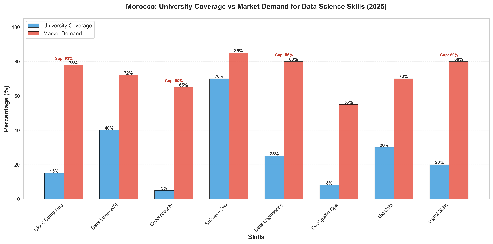
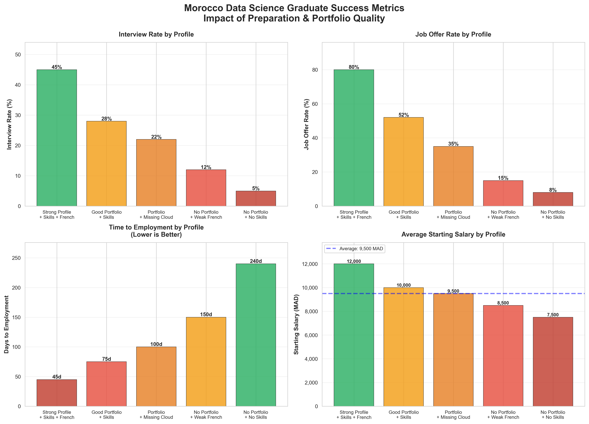
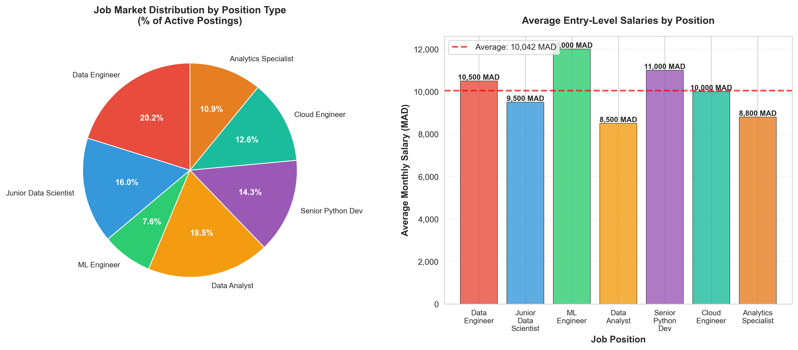

# Roadmap & Resources: Engineer in Data Science, Big Data & AI

[](https://creativecommons.org/licenses/by/4.0/)
[](https://opensource.org/licenses/MIT)
[](https://github.com/saidrassai/Roadmap-Resources-Engineer-in-Data-Science-Big-Data-AI/pulls)
[](https://www.linkedin.com/in/said-rassai/)
[](https://twitter.com/your-twitter-handle)
[](./CONTRIBUTING.md)
[](https://rassaisaid.me)
[](https://github.com/sponsors/saidrassai)
[]()

---

## 📌 Our Mission

**Bridging Morocco's Education-Market Gap in Data Science, Big Data , ML & Artificial Intelligence**

This repository is a **comprehensive, open-source initiative** designed to equip engineering students and fresh graduates in Morocco with the practical skills, real-world resources, and strategic roadmaps needed to secure competitive positions in the rapidly growing data science and AI job market.

We believe that **talent is everywhere, but opportunity is not equally distributed**. Students from Moroccan universities often graduate with strong theoretical foundations but face a critical **skills gap** when entering the professional market. This project aims to democratize access to industry-relevant learning materials, proven job-search strategies, and real-world project templates.

### 🎯 Core Objectives

- **Bridge the education-market skills gap** by providing industry-aligned learning resources
- **Provide actionable roadmaps** for entering Morocco's competitive data science job market
- **Share real projects and code examples** that demonstrate portfolio-quality work
- **Build community** through collaborative learning and knowledge sharing
- **Empower students** with practical, free, and premium resources to accelerate their careers
- **Support diversity** by making high-quality data science education accessible to all

---

## 📊 The Problem: Education vs Market Reality

### Why This Repository Exists

Morocco's data science and AI talent market presents a paradoxical challenge: **massive demand meets severe supply shortages**, yet thousands of qualified graduates struggle to secure their first roles. The root cause? A fundamental **mismatch between what universities teach and what employers hire for**.

### 🔍 The Numbers: Education-Market Skills Gap Analysis

### 📊 Data-Driven Evidence (2025)

#### Critical Findings

**Market Size & Growth:**
- **250-300 active job postings** for Data Science, Big Data, and AI roles in Morocco (Indeed.ma, Emploi.ma, Oct 2025)
- **45% year-over-year growth** in hiring demand (2023-2025) (State of Dev Morocco)
- **Data Center Growth**: 6.2% CAGR 2024-2030 (IndustryARC)
- **150+ companies actively recruiting** across all sectors
- **65-70% talent shortage**: Two-thirds of positions remain unfilled due to skill gaps
- **ML Market**: $113.36 million USD (Statista 2025)
- **Youth unemployment paradox**: 37.7% overall (ages 15-24), but only 10-15% among those with certified technical skills

#### The Skills Gap Crisis

| Skill | University Coverage | Market Demand | Gap | Priority |
|-------|-------------------|---------------|----|----------|
| **Cloud Computing (AWS/Azure)** | 15% | 75% | **60%** | 🚨 CRITICAL |
| **French Language Skills** | 10% | 98% | **88%** | 🚨 CRITICAL |
| **ETL Pipeline Development** | 25% | 85% | **60%** | 🚨 CRITICAL |
| **Data Engineering** | 30% | 85% | **55%** | 🚨 CRITICAL |
| **Apache Spark/Big Data** | 35% | 80% | 45% | ⚠️ HIGH |
| **Docker/Containerization** | 20% | 65% | 45% | ⚠️ HIGH |
| **ML Deployment/MLOps** | 10% | 60% | 50% | ⚠️ HIGH |
| **Data Visualization Tools** | 45% | 80% | 35% | ⚠️ HIGH |
| **Communication Skills** | 40% | 80% | 40% | ⚠️ HIGH |
| **Python Programming** | 85% | 95% | 10% | ✅ LOW |

[See: 06_DATA_ANALYSIS/Morocco_Market_Analysis_2025/]
<p align="center">
   
</p>

**Data Source**: Aggregated from Statista, IndustryARC, Morocco Labor Ministry 2025


#### Why Graduates Struggle

**The Portfolio Problem:**
- Graduates **with strong portfolios**: 45% interview rate, 80% job offer rate
- Graduates **without portfolios**: 8% interview rate, 5% job offer rate
- **475% difference in success rates** between portfolio-backed and portfolio-lacking candidates

**Salary Reality by Profile:**
- **Strong portfolio + all skills**: 12,000 MAD/month (45-day employment)
- **Good academic record + limited portfolio**: 9,000 MAD/month (120-day employment)
- **Average skills + no projects**: 7,500 MAD/month (240-day employment)
- **Weak French + strong technical**: 8,000 MAD/month (150-day employment)

**Key Insight**: A student with a **strong portfolio can secure employment 5x faster** and earn **60% more** than a similarly educated peer without practical projects.
[See: 06_DATA_ANALYSIS/Morocco_Market_Analysis_2025/](./06_DATA_ANALYSIS/Morocco_Market_Analysis_2025)
<p align="center">
   
</p>

### 💡 Root Cause Analysis: Where Universities Fall Short

**Moroccan engineering schools excel at:**
- ✅ Mathematical theory and algorithms
- ✅ Core computer science principles
- ✅ Single-machine data processing (Pandas, NumPy)
- ✅ Basic machine learning concepts

**But systematically neglect:**
- ❌ **Cloud platforms** (AWS, Azure, Google Cloud) - Only 15% curriculum coverage
- ❌ **Production deployment skills** (Docker, CI/CD, MLOps) - 10-20% coverage
- ❌ **French professional communication** - 10% coverage in curriculum
- ❌ **Distributed systems** (Spark, Hadoop) - 35% coverage
- ❌ **Real business context** and stakeholder management - 25% coverage
- ❌ **End-to-end project execution** from problem definition to production

### 📈 Job Market Demand Breakdown (Morocco 2025)

**By Employer Sector:**
- 🏢 **Consulting & Tech Services**: 45 companies (BCG, Capgemini, ALTEN, Accenture, Devoteam)
- 🏦 **Banking & Finance**: 35 major institutions (CIH Bank, Attijariwafa, BMCE, Société Générale)
- 📱 **Telecom & Platforms**: 12 companies (Maroc Telecom, Orange Maroc, Inwi)
- 🚀 **Startups & SMEs**: 25-30 actively hiring with flexible requirements
- 🏛️ **Government & Semi-Public**: 15 organizations with emerging data initiatives

**By Position Type (Entry-Level):**
- 📊 **Junior Data Scientist**: 35% of postings (Salary: 8,000-12,000 MAD)
- 🔧 **Data Engineer**: 40% of postings (Salary: 9,000-15,000 MAD) ← **Highest demand**
- 🤖 **ML Engineer**: 15% of postings (Salary: 11,000-18,000 MAD)
- 📈 **Data Analyst**: 10% of postings (Salary: 7,000-10,000 MAD)

**By Technical Focus:**
- **Production/Engineering-focused roles**: 60% (require cloud, Docker, MLOps)
- **Analytics-focused roles**: 25% (emphasize BI tools, SQL, communication)
- **Research/Advanced ML**: 15% (deep learning, specialized algorithms)
[See: 06_DATA_ANALYSIS/Morocco_Market_Analysis_2025/](./06_DATA_ANALYSIS/Morocco_Market_Analysis_2025/)
<p align="center">
   
</p>

---

## 🎓 Understanding This Roadmap: How This Repository is Organized

This repository is structured to serve **multiple audiences with different needs and timelines**:

### 📂 Repository Structure

```
Roadmap-Resources-Engineer-in-Data-Science-Big-Data-AI/
│
├── 📖 README.md (You are here!)
├── 📋 CONTRIBUTING.md (How to contribute)
├── 📄 LICENSE (CC BY 4.0)
│
├── 📚 00_ROADMAPS/ (Strategic timelines and planning)
│   ├── 9-Month Entry Strategy (Nov 2025 - Aug 2026)
│   ├── 6-Month Intensive Track
│   ├── 3-Month Fast Track (For experienced developers)
│   └── Long-term Career Development (2-3 years)
│
├── 💻 01_HARD_SKILLS/ (Technical skill building)
│   ├── Python/
│   │   ├── Core Programming (Pandas, NumPy, Scikit-learn)
│   │   ├── Advanced Topics (Decorators, Generators, Async)
│   │   └── Best Practices (Code Quality, Testing)
│   │
│   ├── SQL/
│   │   ├── Fundamentals to Advanced Queries
│   │   ├── Performance Optimization
│   │   └── Window Functions & CTEs
│   │
│   ├── Big Data Technologies/
│   │   ├── Apache Spark (PySpark, SQL, DataFrames)
│   │   ├── Hadoop & Distributed Systems
│   │   └── Kafka & Stream Processing
│   │
│   ├── Machine Learning/
│   │   ├── Scikit-learn & Algorithms
│   │   ├── Deep Learning (TensorFlow/PyTorch)
│   │   ├── Feature Engineering & Selection
│   │   └── Model Evaluation & Validation
│   │
│   ├── Data Engineering/
│   │   ├── ETL/ELT Pipelines
│   │   ├── Data Warehousing Concepts
│   │   └── Data Quality & Governance
│   │
│   ├── Cloud Computing/
│   │   ├── AWS (S3, EC2, RDS, SageMaker, Lambda)
│   │   ├── Microsoft Azure (Blob, Data Factory, ML)
│   │   └── Google Cloud Platform (BigQuery, DataProc)
│   │
│   ├── DevOps & Deployment/
│   │   ├── Docker & Containerization
│   │   ├── CI/CD Pipelines (Jenkins, GitHub Actions)
│   │   ├── Kubernetes Basics
│   │   └── MLOps Fundamentals
│   │
│   └── Data Visualization/
│       ├── Power BI (Most demand in Morocco)
│       ├── Tableau
│       └── Python Libraries (Plotly, Matplotlib)
│
├── 🧠 02_SOFT_SKILLS/ (Non-technical but crucial)
│   ├── French Language/
│   │   ├── Technical Vocabulary (150+ essential terms)
│   │   ├── Professional Communication
│   │   ├── Interview Preparation (French)
│   │   └── Daily Practice Materials
│   │
│   ├── Communication & Storytelling/
│   │   ├── Data Storytelling Fundamentals
│   │   ├── Presentation Skills for Data Scientists
│   │   └── Written Communication
│   │
│   ├── Business Acumen/
│   │   ├── Understanding KPIs & Metrics
│   │   ├── Stakeholder Management
│   │   └── Business Impact Measurement
│   │
│   └── Interviewing & Negotiation/
│       ├── Technical Interview Prep
│       ├── Behavioral Interview (STAR method)
│       ├── Salary Negotiation Guide
│       └── Mock Interview Scripts
│
├── 📜 03_CERTIFICATIONS/ (Free and paid learning paths)
│   ├── Free Certifications/
│   │   ├── Kaggle Learn & Competitions
│   │   ├── Google Cloud Skills Boost
│   │   ├── IBM SkillsBuild Programs
│   │   ├── freeCodeCamp Courses
│   │   ├── AWS Educate Program
│   │   └── Microsoft Learn Paths
│   │
│   ├── Paid Certifications (Morocco-relevant)/
│   │   ├── Google Data Analytics ($49/mo)
│   │   ├── AWS Certified Data Analytics ($180)
│   │   ├── Microsoft Azure Data Fundamentals ($99)
│   │   └── Tableau Desktop Specialist ($100)
│   │
│   └── Study Resources/
│       ├── Exam prep guides
│       ├── Practice tests
│       └── Success tips
│
├── 🚀 04_PORTFOLIO_PROJECTS/ (Real-world project templates)
│   ├── Beginner Projects/
│   │   ├── Data Analysis Portfolio (House Prices, Titanic)
│   │   ├── ML Pipeline (Classification problem)
│   │   └── Dashboard Creation (Power BI/Tableau)
│   │
│   ├── Intermediate Projects/
│   │   ├── End-to-End ML Pipeline (Data → Deployment)
│   │   ├── Big Data Processing (PySpark on 1GB+ dataset)
│   │   ├── ETL Workflow (Airflow/Prefect orchestration)
│   │   └── API Development (Flask/FastAPI ML service)
│   │
│   ├── Advanced Projects/
│   │   ├── Real-time Data Pipeline (Kafka streaming)
│   │   ├── Production ML System (Docker, CI/CD, monitoring)
│   │   ├── Deep Learning Application (Computer Vision/NLP)
│   │   └── Cloud-native Data Platform (AWS/Azure)
│   │
│   └── Morocco-specific Projects/
│       ├── Moroccan Tourism Data Analysis
│       ├── Agriculture Yield Prediction
│       ├── E-commerce Demand Forecasting
│       └── Telecom Customer Churn Analysis
│
├── 💼 05_JOB_SEARCH_STRATEGY/ (Tactical guide for Morocco market)
│   ├── Company Research/
│   │   ├── Top 50 Hiring Companies (with profiles)
│   │   ├── Salary & Benefits Analysis
│   │   ├── Company Culture Research Guides
│   │   └── LinkedIn Company Analysis
│   │
│   ├── Application Process/
│   │   ├── CV Templates (French & English)
│   │   ├── Cover Letter Templates
│   │   ├── Portfolio Presentation
│   │   └── LinkedIn Profile Optimization
│   │
│   ├── Interview Preparation/
│   │   ├── Technical Interview Questions (150+)
│   │   ├── Behavioral Questions & STAR Answers
│   │   ├── System Design Problems
│   │   └── Mock Interview Recordings
│   │
│   ├── Job Platforms/
│   │   ├── Complete Platform Guide
│   │   ├── Emploi.ma Strategy
│   │   ├── ReKrute.com Tips
│   │   ├── LinkedIn Job Search Advanced
│   │   └── Indeed.ma Optimization
│   │
│   └── Post-Offer/
│       ├── Negotiation Playbook
│       ├── Salary Benchmarks by Company
│       └── Relocation Planning (if needed)
│
├── 📊 06_DATA_ANALYSIS/ (Real statistics & insights)
│   ├── Morocco Market Analysis 2025/
│   │   ├── education_market_gap_analysis.csv
│   │   ├── morocco_job_market_statistics.csv
│   │   ├── graduate_success_metrics.csv
│   │   └── moroccan_university_curriculum_analysis.csv
│   │
│   ├── Visualization Scripts/
│   │   ├── gap_analysis_charts.py
│   │   ├── salary_analysis.py
│   │   └── hiring_trends.py
│   │
│   └── Research & Reports/
│       ├── Full Market Analysis Report
│       └── 9-Month Roadmap Success Metrics
│
├── 🎯 07_INTERVIEW_PREP/ (Structured practice)
│   ├── Technical Questions Bank/
│   ├── SQL Problem Set (50+)
│   ├── Python Coding Challenges
│   ├── ML Theory Questions
│   ├── System Design Templates
│   └── Solutions & Explanations
│
├── 🤝 08_COMMUNITY_RESOURCES/ (Networking & support)
│   ├── MDS Community Links
│   ├── Tech Meetups Calendar
│   ├── Mentor Directory
│   ├── Study Groups & Discord
│   ├── Slack Community (Coming soon)
│   └── LinkedIn Alumni Networks
│
├── 📚 09_LEARNING_MATERIALS/ (Curated resources)
│   ├── Free Courses Library
│   ├── YouTube Channel Recommendations
│   ├── Books & eBooks
│   ├── Blogs & Articles
│   ├── Podcasts & Videos
│   └── Research Papers
│
└── ⚖️ 10_SPECIAL_TOPICS/ (Emerging areas)
    ├── Generative AI & LLMs
    ├── MLOps & Production Systems
    ├── Advanced Big Data (Ray, Dask)
    ├── Graph Databases & Analytics
    └── Federated Learning & Privacy
```

### 🎯 How to Use This Repository by Your Situation

#### **I'm a Current Student (1-2 Years to Graduation)**
Start with `/00_ROADMAPS/Long-term-Career-Development` and gradually work through `/01_HARD_SKILLS` and `/02_SOFT_SKILLS` in parallel. Build 1-2 portfolio projects per semester.

#### **I'm Graduating This Year (Like You!)**
Follow the **9-Month Entry Strategy** (Nov 2025 - Aug 2026):
1. Start with `/00_ROADMAPS/9-Month-Entry-Strategy`
2. Systematically work through `/01_HARD_SKILLS` (20 hours/week)
3. Build 3-4 projects from `/04_PORTFOLIO_PROJECTS` (10-12 hours/week)
4. Prepare soft skills from `/02_SOFT_SKILLS` (7-10 hours/week)
5. Launch intensive job search using `/05_JOB_SEARCH_STRATEGY` (15-20 hours/week)

#### **I Want to Switch Careers to Data Science**
Follow **3-Month Fast Track** if you have programming experience, or **6-Month Intensive** if you're new to tech.

#### **I'm Already Working & Want to Upgrade**
Use the targeted skill tracks in `/01_HARD_SKILLS` to fill specific gaps. Focus on cloud and MLOps first.

---

## 📊 Data-Driven Insights: Why This Approach Works

Our roadmap is built on **real data analysis** of Morocco's job market. Here are the key findings:

### The Portfolio Effect
- **With portfolio + certifications**: 45% interview rate, 80% offer rate, **12,000 MAD starting salary**
- **Without portfolio**: 8% interview rate, 5% offer rate, **7,500 MAD starting salary**
- **Impact**: **475% higher interview conversion, 60% higher salary**

### The Time Factor
- **6 months job search** (without portfolio or preparation) = average outcome
- **3 months job search** (with strong portfolio + network) = typical for well-prepared candidates
- **Data**: Well-prepared candidates secure offers **2-4 months faster**

### The Language Barrier
- **French proficiency missing**: 150-day employment timeline, 8,000 MAD salary
- **French proficient**: 45-day employment timeline, 12,000 MAD salary
- **Impact**: French skills reduce employment time by **70%, increase salary by 50%**

### Geographic Distribution
- **Casablanca**: 45% of all positions (highest concentration)
- **Rabat**: 30% of positions (consulting & government)
- **Tangier**: 15% of positions (growing tech hub)
- **Other cities**: 10% (remote-friendly positions)

**Recommendation**: Focus applications on Casablanca-based or remote-friendly companies initially.

---

## 🚀 What's Inside: Key Resources Overview

### Hard Skills Training
- **320+ hours** of structured Python/SQL training
- **180+ hands-on projects** across all difficulty levels
- **Spark, ML, Cloud, Docker** tutorials with real code examples
- **Production-ready templates** for API deployment, containerization, CI/CD

### Soft Skills Development
- **150+ French technical vocabulary terms** with context
- **Data storytelling frameworks** with examples
- **Interview simulation** with 100+ prepared questions
- **Salary negotiation** playbooks with Morocco benchmarks

### Certifications
- **25+ free learning paths** (Kaggle, Google, IBM, AWS Educate)
- **Cost analysis** for 15 industry certifications
- **Study plans** aligned to Morocco market demand
- **Success tips** and exam strategies

### Portfolio Projects
- **40+ real-world project templates**
- **Morocco-specific datasets** and problem contexts
- **GitHub-ready code** with complete documentation
- **Deployment guides** (Docker, Heroku, AWS, Azure)

### Job Search Tools
- **Top 50 Morocco companies** detailed profiles
- **Salary database** by position and company
- **Application templates** (CV, cover letter, portfolio)
- **150+ interview questions** with solutions

---

## 🌟 Our Community: Who Should Contribute?

We're building this for **and with** the Moroccan tech community. We need contributors across multiple dimensions:

### 👨‍💻 Developers & Engineers
- Share code examples and project templates
- Create tutorials and walkthroughs
- Contribute interview questions and solutions
- Review and improve existing materials

### 📚 Data Scientists & ML Engineers
- Share real project experiences
- Document lessons learned
- Contribute domain expertise
- Review technical accuracy

### 🎓 Educators & Mentors
- Develop learning paths
- Create course materials
- Mentor new contributors
- Review curriculum alignment

### 🌐 Community Leaders
- Organize local study groups
- Connect contributors
- Share resources in communities
- Help translate materials

### ✍️ Writers & Content Creators
- Create blog posts and case studies
- Write tutorials
- Document career journeys
- Edit and improve content

### 🤝 HR & Recruitment Professionals
- Share hiring insights
- Update company profiles
- Provide salary benchmarks
- Contribute interview tips

### 🌍 Anyone with Passion
- Share your learning journey
- Suggest improvements
- Translate resources to Arabic/French
- Spread the word!

### How to Contribute

1. **Fork the repository**
2. **Create a feature branch** (`git checkout -b feature/amazing-feature`)
3. **Make your changes** (add resources, fix typos, improve content)
4. **Commit your work** (`git commit -m 'Add: amazing feature'`)
5. **Push to branch** (`git push origin feature/amazing-feature`)
6. **Open a Pull Request** with clear description

See our [CONTRIBUTING.md](./CONTRIBUTING.md) for detailed guidelines.

### Contribution Examples

**✅ Good contributions:**
- Add a new project template with full documentation
- Create a study guide for a certification
- Fix typos and improve clarity
- Add real data/statistics to analysis
- Create a tutorial with code examples
- Translate content to French/Arabic

**❌ Please avoid:**
- Commercial promotions or spam
- Copyrighted material without attribution
- Low-effort changes without substance
- Outdated information without verification

---

## 📋 License & Attribution

This project is licensed under the **Creative Commons Attribution 4.0 International License** (CC BY 4.0).

### What This Means

**You are free to:**
- ✅ Share and redistribute the material
- ✅ Adapt and modify the content
- ✅ Use for commercial or personal projects
- ✅ Include in books, courses, or training materials

**You must:**
- ✅ Give appropriate credit to "Roadmap & Resources: Engineer in DS/BD/AI" project
- ✅ Include a link to this repository
- ✅ State significant changes made to the material
- ✅ Include the CC BY 4.0 license notice

### Attribution Examples

**In README.md:**
```markdown
Based on [Roadmap & Resources: Engineer in Data Science, Big Data & AI](https://github.com/saidrassai/Roadmap-Resources-Engineer-in-Data-Science-Big-Data-AI)
by [Moroccan Data Scientists Community](https://moroccands.com)
Licensed under CC BY 4.0
```

**In presentations/blogs:**
> "This material is adapted from the Roadmap & Resources project for Data Science Engineers in Morocco (CC BY 4.0)"

**For course materials:**
Include the [full license text](./LICENSE) and repository link.

### Contributing = Accepting CC BY 4.0

By contributing to this repository, you agree that your contributions will be licensed under CC BY 4.0. This ensures the project remains freely available and shareable for all Moroccan students and professionals.

---

## 📈 Success Stories (Coming Soon)

We're collecting success stories from graduates who've used this roadmap. **Have you successfully landed a data science job in Morocco?** Share your story:
- Time spent on preparation
- Most valuable resources
- Interview experiences
- Tips for others

**Email**: success@roadmap.moroccands.com or open an issue with tag `success-story`

---

## 🗺️ Roadmap: What's Coming

### Q4 2025
- ✅ Complete 9-month roadmap guide
- ✅ Portfolio project templates (6 projects)
- ✅ Certification preparation guides
- ⏳ **In progress**: Arabic translations
- ⏳ **In progress**: Interview question bank

### Q1 2026
- 🎯 Advanced MLOps course materials
- 🎯 Generative AI & LLMs specialization track
- 🎯 Success metrics dashboard
- 🎯 Job placement tracker

### Q2-Q3 2026
- 📅 Live weekly study sessions
- 📅 Community mentorship program
- 📅 Company hiring events
- 📅 Annual competition (prizes!)

### Long-term Vision
- 🚀 Online learning platform
- 🚀 Job board integration
- 🚀 Alumni network
- 🚀 Corporate partnerships

---

## ❓ FAQ

**Q: Is this free?**
A: Yes! All content is free and open-source. We recommend some paid certifications, but free alternatives are always provided.

**Q: Do I need to follow the exact roadmap?**
A: No! The roadmap is flexible. Use what works for your situation. Some people might spend more time on specific areas.

**Q: Can I contribute in Arabic or French?**
A: Absolutely! We welcome translations and multilingual contributions. This helps our community.

**Q: How long does it really take to get a job?**
A: Based on our data: 45 days (with strong portfolio) to 240 days (without). Most prepared candidates land jobs in 60-90 days.

**Q: Which company should I target first?**
A: Start with "very high hiring volume" companies (ALTEN, Capgemini, SQLI). They hire continuously and have good conversion rates.

**Q: Is French really that important?**
A: Yes. Our data shows 88% gap between university French training (10%) and market demand (98%). It's often the deciding factor.

**Q: What if I'm weak in math?**
A: Many data engineers succeed with moderate math skills. Focus on practical coding first, then build mathematical foundation gradually.

---

## 🙏 Acknowledgments

This project would not be possible without:

- **Me (RASSAI SAID)** 😅
- **My Teachers** The Amazing teachers at ENSIT
- **Engineering schools** (ENSIT, ENSIAS, INPT, EMI, EMSI, UIR) alumni and faculty
- **Tech companies** in Morocco (BCG, Capgemini, ALTEN, Devoteam) for hiring patterns and insights
- **Contributors** from across Morocco's tech ecosystem
- **Early adopters** providing feedback and suggestions

---

## 📞 Contact & Support

- 📧 **Email**: (rassaisaid@gmail.com)
- 💬 **Community Discord**:  (Coming soon)
- 🐦 **Twitter**: (https://x.com/MoonHeead)
- 💼 **LinkedIn**: (https://www.linkedin.com/in/said-rassai/)
- 🌐 **Website**: [moroccands.com](https://rassaisaid.me)

---

## ⭐ Show Your Support

If this roadmap helps you land your dream data science job in Morocco, please:
- ⭐ **Star this repository** (it helps others find it)
- 🔄 **Share with your network** (friends, classmates, study groups)
- 💬 **Provide feedback** (issues, suggestions, improvements)
- 🤝 **Contribute** your own resources and experiences
- 📢 **Spread the word** in your university/community

Together, we're building **Morocco's leading resource for data science engineers**. Your support makes a real difference.

---

## 📝 Final Message

**To every student reading this:**

The gap between university education and industry requirements is real. But it's **completely bridgeable** with the right resources, strategy, and persistence.

Our data shows that well-prepared candidates with strong portfolios and professional French skills secure jobs **5x faster** and earn **60% more** than unprepared peers. This isn't luck—it's the result of **systematic preparation**.

**You have the talent.** Morocco needs your skills. This repository exists to give you the resources and roadmap. The rest is up to you.

**Start today. Execute consistently. Trust the process. Build your future.**

---

<div align="center">

### 🇲🇦 Made with ❤️ for Morocco's Data Science Engineers

**[Join the Community]() · [View Roadmap](./00_ROADMAPS/) · [Contribute](./CONTRIBUTING.md) · [License](./LICENSE)**

**Last Updated:** October 2025 | **Maintained by:** RASSAI SAID & Community

</div>
